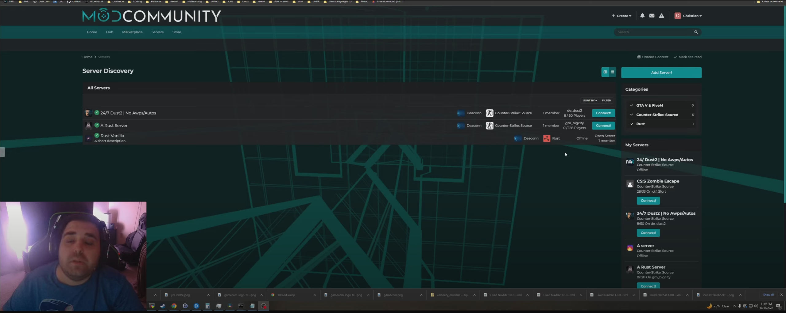

# TMC Server Engine
A Go program that updates server's real-time information such as member/player counts, map names (for game servers), and more from [The Modding Community](https://moddingcommunity.com/) (the [@modcommunity](https://github.com/modcommunity)) while interfacing with its API. This will also be generating stats, ranks, and banners for these servers in the future! A verification system is also implemented.

## Configuration
General configuration may be found below.

```bash
{
    # Debug level from 0 - 4.
    "debug": 0,

    # Retrieve endpoint.
    "retrieveurl": "https://mydomain.example/servers",
    
    # Update endpoint.
    "updateurl": "https://mydomain.example/servers",

    # Whether to try basic auth (no Authorization header set; instead, sets a GET query key).
    "basicauth": false,

    # The auth token. With basic auth off, this is set to the Authorization header without things like "Bearer".
    "token": "Bearer mykey",

    # The key parameter GET name for basic auth.
    "keyparam": "key",

    # The claim field key name.
    "claimkeyfield": "claimkey",

    # Max servers to retrieve and update.
    "maxservers": 40,

    # Max servers per page.
    "maxserverspr": 40,

    # Sort (least last updated by default).
    "sort": "laststatupdate ASC",

    # Wait interval between querying servers in milliseconds.
    "waitinterval": 1000,

    # Fetch interval between retrieving servers in milliseconds.
    "fetchinterval": 1000
}
```

## More Details
I have been working on an application that lists community and game servers that may be tied by communities (AKA clubs) in [Invision Power Services](https://invisioncommunity.com/). Please see below for a preview of how everything looks as of **October 12th, 2022**. I've been making a lot of great progress on this within a few days. This is being internally developed at the moment, but I will be looking into open-sourcing the application in the future after business-related things are situated in the [@modcommunity](https://github.com/modcommunity) along with ensuring we aren't putting user's security at risk (e.g. having multiple views at source code for any potential vulnerabilities).

<a href="https://www.youtube.com/watch?v=f-HXM6tCOXY" target="_blank"></a>

Each engine spawns its own thread and retrieve servers (preferably sorted by the last time the server was queried by the specific engine, then updating these values with Unix timestamps when updating a server's information). Support for spawning multiple threads/Go routines will also be added for best multi-threading support. Though, I don't think multiple threads per engine will matter much at this moment.

## Credits
* [Christian Deacon](https://github.com/gamemann)